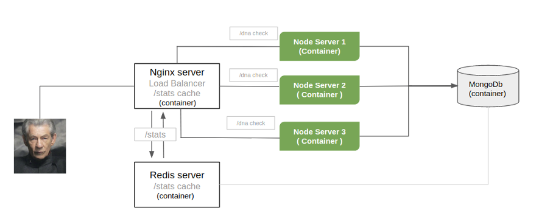

# Magneto is looking for missing mutants
   
   Magneto ADN tool analyzer 


## Purpose
Find any mutant living around the world

## Stack
```sh
NodeJs, ExpressJS, MongoDb, NGINX, Redis, AWS Cloud, Ubuntu Server , REST API Standar, docker , docker-compose
```



## Solution

  #### A cluster with a load balancer.
  
   1  <a href="https://github.com/danillanos/mutants-dna/blob/master/config/nginx/nginx.conf#L14-L20">NGINX</a> server as a load balancer and first cache level for  <b>/stats</b> endpoint
          <div> 
            <a href="http://mutants-dna.dsupport2000.com/mutants" >http://mutants-dna.dsupport2000.com/mutants</a>
            <br/>
          </div>
          <div> 
            <a href="http://mutants-dna.dsupport2000.com/stats" >http://mutants-dna.dsupport2000.com/stats</a>
          </div>

   3 servers (node) balancing the load conected to a mongo db database 
        <br/>
        <br/>
        Mutants
        <div> 
            <a href="http://mutants-dna.dsupport2000.com:5000/mutants" >http://mutants-dna.dsupport2000.com:5000/mutants</a>
            <br/>
        </div>
        <div> 
            <a href="http://mutants-dna.dsupport2000.com:5001/mutants" >http://mutants-dna.dsupport2000.com:5001/mutants</a>
            <br/>
        </div>
        <div> 
            <a href="http://mutants-dna.dsupport2000.com:5002/mutants" >http://mutants-dna.dsupport2000.com:5002/mutants</a>
        </div>
        <br/>
        Stats
        <div> 
            <a href="http://mutants-dna.dsupport2000.com:5000/stats" >http://mutants-dna.dsupport2000.com:5000/stats</a>
              <br/>
        </div>
        <div> 
            <a href="http://mutants-dna.dsupport2000.com:5001/stats" >http://mutants-dna.dsupport2000.com:5001/stats</a>
              <br/>
        </div>
        <div> 
            <a href="http://mutants-dna.dsupport2000.com:5002/stats" >http://mutants-dna.dsupport2000.com:5002/stats</a>
        </div>

  1 server (node) with a REDIS  cache for specifics calls like stats
        <div> 
            <a href="http://mutants-dna.dsupport2000.com:3000/stats" >http://mutants-dna.dsupport2000.com:3000/stats</a>
        </div>

     A CRON JOB at OS level runnig each 30 minutes :
     
     cache creator
```sh
    curl --header "Content-Type: application/json" \
    --request POST \
    --data $(curl http://mutants-dna.dsupport2000.com/stats) \
    http://mutants-dna.dsupport2000.com:3000/store
```    

### How to Install & Run

All the platform is running under docker handling the cluster through docker-compose in order to have a scalability option 
```sh
http://localhost is the development url
```
```sh
docker-compose up -d
```
```sh
CONTAINER ID        IMAGE                     COMMAND                  CREATED             STATUS              PORTS                      NAMES
c4143d18798c        mutantsdna_server3        "pm2-dev server/se..."   About an hour ago   Up About an hour    0.0.0.0:5002->5000/tcp     mutantsdna_server3_1
5227c250ce9a        nginx:1.13.11             "nginx -g 'daemon ..."   About an hour ago   Up About an hour    0.0.0.0:80->80/tcp         mutantsdna_nginx_1
83d8072e8797        mutantsdna_server-cache   "sh -c 'npm i && n..."   About an hour ago   Up About an hour    0.0.0.0:3000->3000/tcp     mutantsdna_server-cache_1
cfea3ca96160        mutantsdna_server2        "pm2-dev server/se..."   About an hour ago   Up About an hour    0.0.0.0:5001->5000/tcp     mutantsdna_server2_1
7ab69c05ba20        mutantsdna_server         "pm2-dev server/se..."   About an hour ago   Up About an hour    0.0.0.0:5000->5000/tcp     mutantsdna_server_1
6b9c615bea10        redis                     "docker-entrypoint..."   About an hour ago   Up About an hour    6379/tcp                   cache
147e6f005b4f        mongo:3.6.3               "docker-entrypoint..."   About an hour ago   Up About an hour    0.0.0.0:27017->27017/tcp   mutantsdna_mongodb_1

```

### Run the test suite
```sh
npm install 
npm run test --coverage
```
    
### Adding and verifying dnas 
('adn' is the object key)
```sh
curl --header "Content-Type: application/json" \
  --request POST \
  --data '{"adn" :["ETGCGA","CEGTTC","TTTTTT","AGAAGG","CTCCGA","TEYYYY"]}' \
  http://mutants-dna.dsupport2000.com/mutants
```


